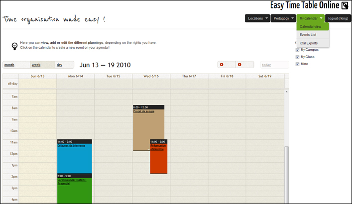
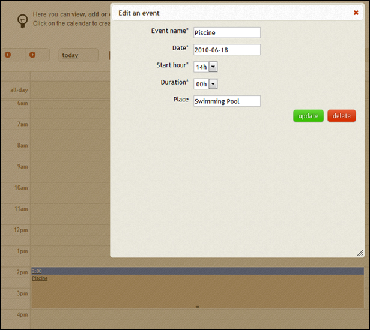
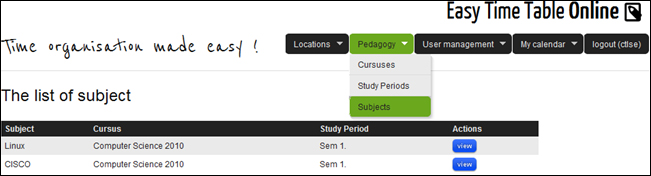
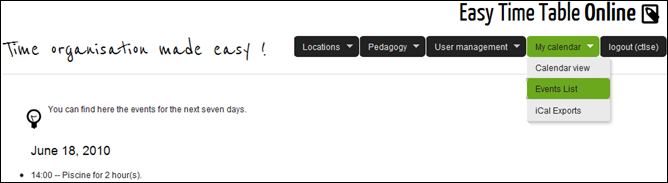
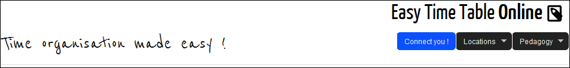

Documentation utilisateur
#########################

Utilisation de la solution
==========================

Cette documentation décrit en détail les differentes fonctionalités qui peuvent
être utilisées, de notre logiciel.

Fonctionnalités Communes
------------------------

Créer, Lister, Afficher, Modifier, Supprimer ses propres évènements.
~~~~~~~~~~~~~~~~~~~~~~~~~~~~~~~~~~~~~~~~~~~~~~~~~~~~~~~~~~~~~~~~~~~~~~~~

Il est possible de gérer ses evenements personnels. Pour cela il suffit, pour
l'ajout, de cliquer sur le calendrier, et pour la suppression et la
modification, de selectionner l'evenement sur le calendrier, puis de renseigner
les champs qui apparaissent à l'écran.

.. image:: pictures/eventAdd.jpg
   :width: 100%

Lister et Afficher les Universités, les Campus, les lieux
~~~~~~~~~~~~~~~~~~~~~~~~~~~~~~~~~~~~~~~~~~~~~~~~~~~~~~~~~~~~~

EasyTimeTable permet de visualiser les differents lieux, d'une manière
similaire. Il suffit pour cela d'utiliser le menu qui se situe en haut à droite
de chaque page, puis de selectionner l'element souhaité.

.. image:: pictures/locationsList.jpg
   :width: 100%
   
Lister et Afficher les Cursus, les periodes d'étude et les matières
~~~~~~~~~~~~~~~~~~~~~~~~~~~~~~~~~~~~~~~~~~~~~~~~~~~~~~~~~~~~~~~~~~~~

De la même manière, pour visualiser les elements en relation avec ce que nous
apellons la "pedagogie", selectionnez les elements depuis le menu.

   
Lister et Afficher les Classgroups, les Students, les Campus Managers, les Teachers
~~~~~~~~~~~~~~~~~~~~~~~~~~~~~~~~~~~~~~~~~~~~~~~~~~~~~~~~~~~~~~~~~~~~~~~~~~~~~~~~~~~~

.. image:: pictures/userManagementList.jpg
   :width: 100%

Lister les evenements de planning
~~~~~~~~~~~~~~~~~~~~~~~~~~~~~~~~~~

Il est possible de visualiser les evenements contenus dans un planing de trois
manières differentes:

    * via une liste "simple", des prochains evenements à venir
    * via le calendrier
    * via des données exportées au format iCal.

La liste simple constitue la version "mobile de notre application".

* Lister les prochains evenements

   
* Exporter son planning au format iCal.

.. image:: pictures/iCal.jpg
   :width: 100%

Se déconnecter.
~~~~~~~~~~~~~~~~

Si vous souhaitez vous déconnecter, utilisez le menu de droite.

.. image:: pictures/deauth.jpg
   :width: 100%

Autres Fonctionctionnalités
---------------------------

Lorsqu'un élément de `Lieux` est affiché (Université, Campus, Lieu), 
sa localisation géographique est également affichée sur une carte.

.. image:: pictures/locationsShow.jpg
   :height: 400px

Lorsqu'une `Période d'étude` ou une `matiere` sont affichés, il est possible de 
visualiser des graphiques mettant en valeur la répartition des contenus
pedagogiques (en camembert pour les matières, et en barres cummulées pour 
les périodes d'étude).

.. image:: pictures/pedagogyShow.jpg
   :height: 400px

Niveaux de privilèges
---------------------

Utilisateur non authentifié
~~~~~~~~~~~~~~~~~~~~~~~~~~~~

Un utilisateur non authentifié à un accès en lecture sur l'ensemble des elements
suivants. Il ne peut pas les modifier, ni les supprimer ou en ajouter:

* Les Universités

* Les Campus

* Les Places

* Les Cursuses

* Les Study Periods

* Les Subjects

Il est bien sur également possible de s'authentifier.

Elève
~~~~~~

Un élève à accès à son planning personnel, et est associé à une classe.
Il à donc accès aux fonctionalités communes, et peut également visualiser le
planning de son campus et de sa classe.

Pour cela, il suffit de selectionner les calendrier que l'on souhaite
visualiser, grace au menu situé à droite du calendrier.

Intervenant
~~~~~~~~~~~~

Un intervenant est chargé de dispenser des cours.

Il gère son propre planning, mais il est aussi associé à des cours, ou à
d'autres évènements de plannings.

Campus Manager
~~~~~~~~~~~~~~

Un campus manager gère un campus, les places et les classgroups associés.

Il peut donc, en plus des fonctionnalités communes :

* Créer, lister, modifier, Supprimer

	* Les Places associées à son campus.
	
	* Les Classgroups
	
	* Les Students
	
	* Les Teachers

.. image:: pictures/classgroupCRUD.jpg
   :width: 80%

Administrateur
~~~~~~~~~~~~~~

L'administrateur peut Créer, Lister, Modifier ou Supprimer tous les éléments
de l'application sauf les évènements personnels d'autres utilisateurs.

Il ne peut effectuer aucune action concernant un évènement personnel d'un
autre utilisateur.
