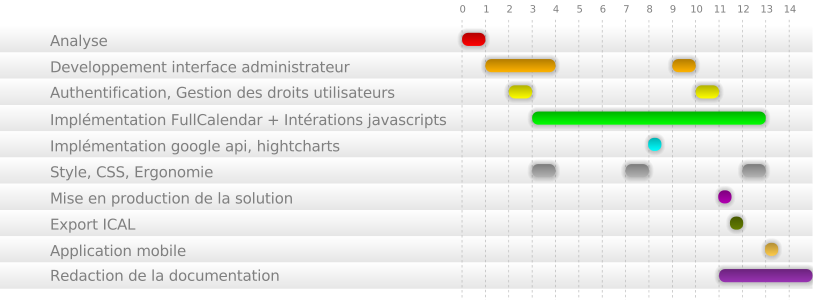

Couts de la solution
#####################

Pour étudier le coût de notre application, nous devons prendre en compte l'investissment humain mais aussi l'investissement logiciel.

Investissement Humain : 
-----------------------

Coût en homme jour:

    Analyse(modélisation, mokups) : 4 jour
    Développement de l'interface administrateur : 4 jour
    Authentification, gestion des droits utilisateurs : 2 jour
    Implémentation google api, hightcharts : 1/2 jour
    Style, css, ergonomie : 4 jours
    Implémentation de FullCalendar + intéractions javascripts : 20 jour
    Mise en production de la solution : 1/2 jour
    Redaction de la documentation : 6 jour
    Application mobile: 1/2 
    Export ical : 1/2

total 40 jour/homme

Nous somme un groupe de 4, et n'étant pas touours tous disponible au même date le travail s'est étalé sur 15 jours de travail, pour une représentation plus connotative veuillez vous référer au diagrame ci-dessous:

En considerant notre niveau d'étude et l'experience de chacun en entreprise, on peut considérer que nous sommes 4 ingenieurs en developpement ce qui sur la grille salarial équivaux à 100 euro jour par personne.

Pour developper Timetableasy nous avons donc eu un coût de main d'oeuvre de 40 jour * 100 euro soit 4000 euro.

Investissement Logiciel :
-------------------------

Nous avons utilisé uniquements des outils open source ce qui fixe notre montant en dépense logiciel à 0 euro.

Etude de la concurence et fixation d'un prix pour Timetableasy:
---------------------------------------------------------------

Le premier concurent à notre logiciel est hyperplanning, bien implenter dans le monde l"education francaise il fixe les tarifs de son système de planning avec un forfait annuel ou en vendant la licence de son logiciel.
Il possède trois type offre :
    - Monoposte avec un seul poste possédant la capacité d'administrer le systeme de planning à 1140 euro HT annuel ou 3406 euro HT à vie
    - Reseaux local à 2376 euro HT à l'année, 7114 euro HT à vie 
    - Reseau local et internet à 3406 euros à l'année et 10204 euro HT à vie.
De plus pour pouvoir mettre en ligne les plannings, le client devra s'offrir un site internet non compris dans l'offre.

Au niveau des fonctionalités, hyperplanning possède une fonction pour comptabiliser l'absence et la présence des élèves que nous ne possédont pas.
En revanche nous possédons une capacité à gérer plusieurs universités, la géolocation des différentes universités et autres lieux, la représentation des graphique de nos informations (hors calendrier), et un plus large panel de type d'utilisateur.

Notre logiciel lui, fournis un site internet, mais peut aussi être inclus dans un site internet déjà existant.

Etant donnée le faible demande, hyperplanning et ses concurent répondant déjà à une bonne part du marché nous devons nous aligner sur les prix du marché.

Un prix de 2000 euro HT me parait correct aux vues des fonctionnalités proposées et nous permettrai au bout de 2 ventes de rembourser l'investissement que nous avons fait.
Chaque client sera libre de demander un personnalisation ou des modules complémentaires à un pris forfaitaire permettant au différents développeurs de maintenir et d'enrichir l'application.
L'hebergement n'est pas inclus dans le prix du logiciel, le logiciel est installable sur toute les plateforme et si le client le demande nous pouvons nous occupez de l'installation et de la maintenances.
