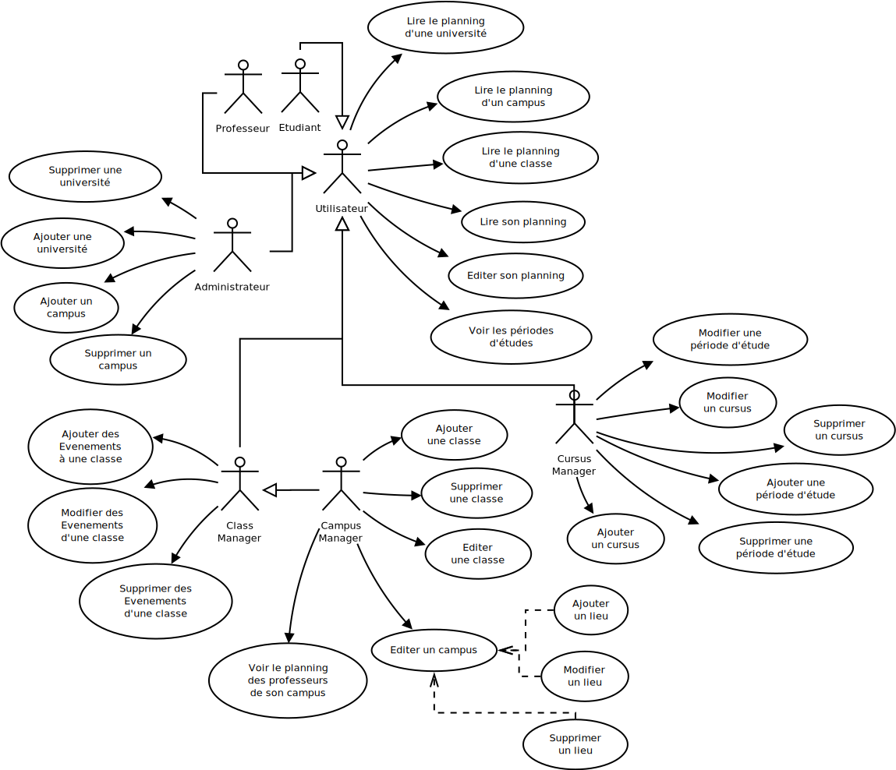

Analyse du besoin
==================

A partir des docuemnts fournis par les clients, nous avons effectué une analyse
du besoin, qui se décline en plusieurs parties: analyse fonctionelle (les cas
d'utilisation), et analyse de l'architecture de notre application.

Nous avons choisi d'utiliser la méthode UML (Unified Modeling Language) pour
décrire les cas d'utilisation, ainsi que pour décrire notre diagramme de
classes.

Nous avons également souhaité partir des besoins metier afin de répondre le
mieux possible à la demande. La présentation du projet nous expose le besoin
metier, voici le document que nous avons réalisé pour syntethiser ce besoin:

.. image:: pictures/mindmapping.png

Cas d'utilisation
------------------

Voici l'ensemble des cas d'utilisation, qui sont illustré grace au diagramme UML
disponible juste en dessous.

Données / Diagrame  de classes
-------------------------------

Voici une representation, generée depuis notre projet django, des modèles (la
aprtie metier de notre application) que l'on à défini à partir des besoins du
projet.

.. image:: pictures/model.png

Architecture de l'application
------------------------------

Un des avantages de s'appuyer sur un framework *full stack* est qu'il définit de
manière très claire une architecutre logicielle qui fonctionne, et qui à fait
ses preuves.

Cela n'empèche aucunement de faire par soi même une architecutre logicielle,
mais permet de ne pas s'en soucier si cela n'est pas necessaire. Pour présenter
un peu les concepts que met en avant django, voici une rapide description:

Model - View - Template
~~~~~~~~~~~~~~~~~~~~~~~~

Le motif MVT, pour Model, Vue, Template, est très proche du modèle assez connu
*MVC* (pour Modèle, Vue, Controleur). Alors que le motif *MVC* défini les
couches comme suit:

    * Modèle : Accès à la persistance des données. Ce sont les modèles qui se
      chargent de la relation base de donnée vers le monde objet (ORM), et qui
      idéalement (cela diffère selon les versions), s'occuppent de la validation
      des données.

    * Vue : La vue represente la partie IHM (Interface Homme Machine) de
      l'application. Dans un site web, c'est la vue qui s'occupe de transformer
      les données metier en HTML, par exemple. Une vue peut faire appel à des
      templates pour s'afficher.

    * Contrôleur : C'est le composant qui se charge de faire la liaison entre le
      modèle et la vue. Il effectue les transformations necessaires et contient
      peu de logique.

Le motif, *MVT* garde la même définition du modèle, mais il est necessaire de
comprendre les differences de notions de vues et de templates:

    * Les Vues remplacent ici completement les contrôleurs (MVC), et prennent
    également une partie des responsabilité des vues MVC. Ce sont elles qui
    passent les informations aux templates.

    * Les templates sont des modèles d'affichage pour du HTML, qui est quasiment
      toujours utilisé dans le motif *MVC*. 

Pour illustrer, voici un schema qui permet de mieux saisir les differences:

.. image:: pictures/mvtmvc.png
