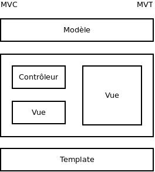

Architecture logicielle
#######################

Un des avantages de s'appuyer sur un framework *full stack* est qu'il définit de
manière très claire une architecutre logicielle qui fonctionne, et qui à fait
ses preuves.

Cela n'empèche aucunement de faire par soi même une architecutre logicielle,
mais permet de ne pas s'en soucier si cela n'est pas necessaire. Pour présenter
un peu les concepts que met en avant django, voici une rapide description:

Model - View - Template
=======================

Le motif MVT, pour Model, Vue, Template, est très proche du modèle assez connu
*MVC* (pour Modèle, Vue, Controleur). Alors que le motif *MVC* défini les
couches comme suit:

    * Modèle : Accès à la persistance des données. Ce sont les modèles qui se
      chargent de la relation base de donnée vers le monde objet (ORM), et qui
      idéalement (cela diffère selon les versions), s'occuppent de la validation
      des données.

    * Vue : La vue represente la partie IHM (Interface Homme Machine) de
      l'application. Dans un site web, c'est la vue qui s'occupe de transformer
      les données metier en HTML, par exemple. Une vue peut faire appel à des
      templates pour s'afficher.

    * Contrôleur : C'est le composant qui se charge de faire la liaison entre le
      modèle et la vue. Il effectue les transformations necessaires et contient
      peu de logique.

Le motif, *MVT* garde la même définition du modèle, mais il est necessaire de
comprendre les differences de notions de vues et de templates:

    * Les Vues remplacent ici completement les contrôleurs (MVC), et prennent
    également une partie des responsabilité des vues MVC. Ce sont elles qui
    passent les informations aux templates.

    * Les templates sont des modèles d'affichage pour du HTML, qui est quasiment
      toujours utilisé dans le motif *MVC*. 

Pour illustrer, voici un schema qui permet de mieux saisir les differences:

Structure de notre application
==============================

Alors que nous utilisons des modèles pour representer nos données, il est
possible de séparer les differentes vues en fonction de leur rôle, et afin de
gagner une plus grande lisibilité et compréhension du code (il serait difficile
d'avoir l'ensemble des vues dans un seul et même fichier).

Plusieurs solutions sont possibles, une d'entre elle est de simplement séparer
les vues en fonction de la ressource sur laquelle les actions agissent.

Cela nous donnes la structure suivante::

    agenda/
        urls.py
        models.py
        managers.py
        views/
            classgroups.py
            campus.py
            universities.py
            plannings.py
            studyperiods.py
            cursus.py
            places.py
        templates/
            agenda/
                base.html
                classgroups/
                    add.html
                    edit.html
                    ...
                campus/
                universities/
                ...

Séparation des applications
===========================

Nous avons ici choisi de mettre l'ensemble de la logique dans une application
qui s'apelle agenda, qui fait partie du projet "timetableeasy".

Il sera par la suite possible d'ajouter facilement d'autres applications, qui
auront pour rôle de faire d'autres choses que la logique liée à la gestion des
agendas, par exemple pour ajouter des fonctionalités CMS à l'application finale.

Managers
========

Les managers sont des objets qui s'occupent de faire les queryset, pour
intéragir avec l'ORM de django. Dans l'exemple ci dessous, nous utilisons le
manager par default de django, fourni avec les modèles, sous le nom "objects"::

    >>> MyModel.objects.all()
    [<MyModel "Model1">, <MyModel "Model2">]

Ici, nous avons renvoyé l'ensemble des objects MyModel.
Il est possible d'étendre le manager que django fournit par defaut, et de
specifer ses propres méthodes pour notre manager. Par exemple pour récupérer les
emplois du temps relatifs à un utilisateur, on peut imaginer avoir une méthode
`for_user`::

    >>> Event.objects.for_user(user)
    [<Event "Event #2">, <Event "Event #34">]

Les managers sont définis dans le module python `managers.py`. Si besoin, il
sera possible par la suite de le découper en plusieurs fichiers.

Templates
=========

Les templates sont une surcouche à du HTML, pour permettre une intégration
facile avec django. Ils sont situés selon le schema suivant: 
`templates`/`appname`/`viewname`/`actionname`.html
