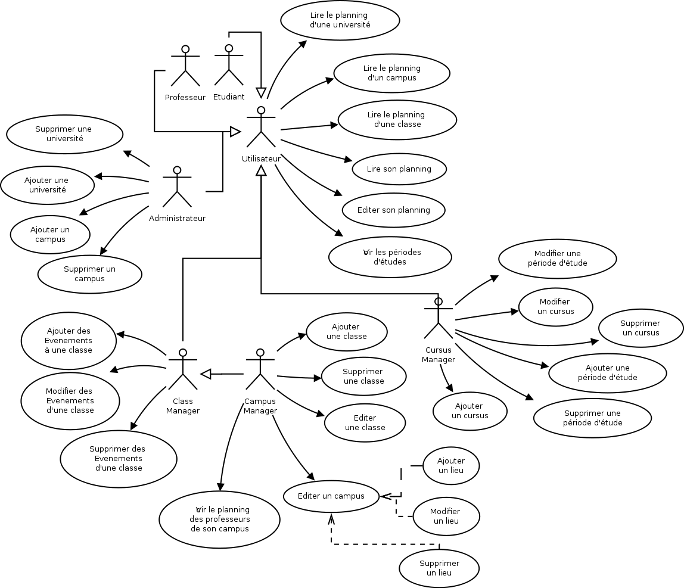
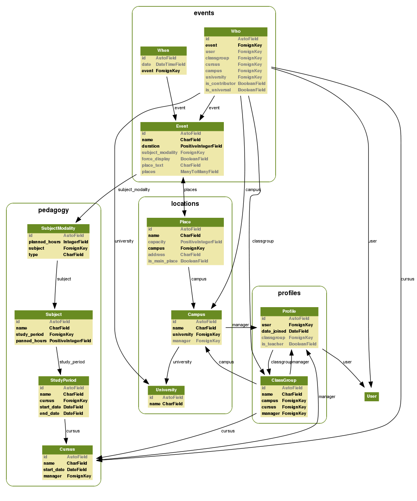
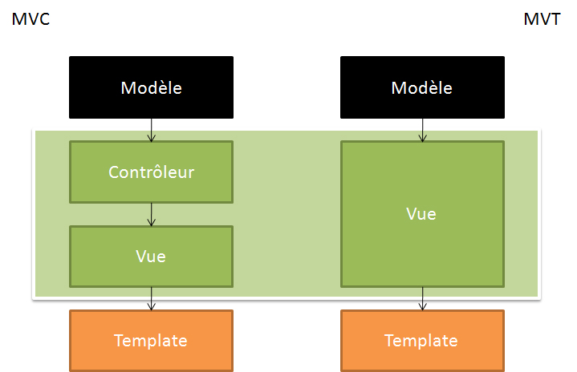

Analyse et modélisation
########################

Voici l'analyse que nous avons effectuée grâce au cahier des charges fourni par
le client.

Les schémas ci-dessous utilisent la notation UML (Unified Modeling Langage), qui
est une manière de se représenter les problématiques logicielles.

Analyse et compréhension du besoin métier
==========================================

Pour commencer, nous avons construit une mind map, après lecture de l'ensemble
des documentations fournies par le client. L'idée ici était de mettre à plat 
notre compréhension des besoins utilisateurs, pour ensuite travailler sur la
modélisation du besoin. Vous pouvez trouver le résultat sur la page suivante.

Différents cas d'utilisation
=============================

Voici les différents cas d'utilisations que nous avons recensés, et qui
représentent la base de notre projet.

Au vu du nombre de cas d'utilisations, le diagramme est un peu surchargé, mais
nous avons fait notre mieux pour qu'il puisse rester lisible.

Diagrammes de classe, base de données
=====================================

Nous utilisons Django, et celui ci propose des outils qui permettent de
réfléchir au niveau du développeur et non pas des bases de données. En d'autres
termes, il est possible de se concentrer sur la modélisation de nos objets, et
le stockage de ceux-ci dans une base de données (relationnelle ou non) est
automatiquement géré par le framework.

Il est bien évidemment possible de choisir une base de donnée particulière en
fonction des besoins, mais il ne semblait pas y en avoir ici, donc c'est un
point que nous laissons à l'appréciation du client. Les solutions techniques
existent et sont très facilement exploitables.

Nous n'avons donc pas réalisé de diagramme de modélisation des données, mais un
diagramme des relations qui existent entre nos différentes classes qui font
partie du modèle de données.

Les deux images ci dessous représentent de manière exhaustive ou non les
relations entre les différentes données.

Architecture logicielle sous-jacente
=====================================

Comme vous pouvez le remarquer, nous avons choisi de séparer le projet selon
quatre types de ressources :

    * les évènements
    * la pédagogie
    * les espaces
    * les classes et profils

Avant d'expliquer plus en détail l'architecture que nous avons mis en
place, il est nécessaire d'expliquer comment fonctionne Django. 

Comment Django fonctionne-t-il ?
--------------------------------

Un des avantages de s'appuyer sur un framework *full stack* est qu'il définit de
manière très claire une architecture logicielle qui fonctionne, et qui à fait
ses preuves.

Cela n'empêche aucunement de faire par soi même une architecture logicielle,
mais permet de ne pas s'en soucier si cela n'est pas nécessaire. Pour présenter
un peu les concepts que met en avant Django, voici une rapide description, qui
permettra de mieux expliquer par la suite l'architecture logicielle que nous
avons mise en place.

Model - View - Template
~~~~~~~~~~~~~~~~~~~~~~~

Le motif MVT, pour Model, Vue, Template, est très proche du modèle mieux connu : *MVC* (pour Modèle, Vue, Contrôleur). Alors que le motif *MVC* définit les
couches comme suit:

    * Modèle : Accès à la persistance des données. Ce sont les modèles qui se
      chargent de la relation base de donnée avec le monde objet (ORM), et qui
      idéalement (cela diffère selon les versions), s'occupent de la validation
      des données.

    * Vue : La vue représente la partie IHM (Interface Homme Machine) de
      l'application. Dans un site web, c'est la vue qui s'occupe de transformer
      les données métier en HTML, par exemple. Une vue peut faire appel à des
      templates pour s'afficher.

    * Contrôleur : C'est le composant qui se charge de faire la liaison entre le
      modèle et la vue. Il effectue les transformations nécessaires et contient
      peu de logique.

Le motif, *MVT* garde la même définition du modèle, mais il est nécessaire de
comprendre les différences de notions de vues et de templates:

    * Les Vues remplacent ici complètement les contrôleurs (MVC), et prennent
      également une partie des responsabilité des vues MVC. Ce sont elles qui
      passent les informations aux templates.

    * Les templates sont des modèles d'affichage pour du HTML, qui est quasiment
      toujours utilisé dans le motif *MVC*. 

Pour illustrer, voici un schéma qui permet de mieux saisir les différences:

Séparation des applications
~~~~~~~~~~~~~~~~~~~~~~~~~~~

Django encourage la séparation des applications, afin d'isoler les différentes
logiques du projet. Nous avons donc choisi de séparer notre application en
plusieurs applications. 

La structure est la suivante::

    events
    pedagogy
    locations
    profiles
    utils

Il sera par la suite possible d'ajouter facilement d'autres applications, qui
auront pour rôle de faire d'autres choses que la logique liée à la gestion des
agendas, par exemple pour ajouter des fonctionnalités CMS à l'application finale,
d'ailleurs, Django propose des applications pour ce genre d'utilisations.

Managers
~~~~~~~~

Les managers sont des objets qui s'occupent de construire les queryset, pour
interagir avec l'ORM de Django. Dans l'exemple ci dessous, nous utilisons le
manager par défaut de Django, fourni avec les modèles, sous le nom "objects"::

    >>> MyModel.objects.all()
    [<MyModel "Model1">, <MyModel "Model2">]

Ici, nous avons renvoyé l'ensemble des objets MyModel.
Il est possible d'étendre le manager que Django fournit par défaut, et de
spécifier ses propres méthodes pour notre manager. Par exemple pour récupérer les emplois du temps relatifs à un utilisateur, on peut imaginer avoir une méthode `for_user`::

    >>> Event.objects.for_user(user)
    [<Event "Event #2">, <Event "Event #34">]

Les managers sont définis dans le module python `managers.py`. Si besoin, il
sera possible par la suite de le découper en plusieurs fichiers.

Templates
~~~~~~~~~

Les templates servent sur-couche à du HTML, pour permettre une intégration
facile avec Django. Ils sont situés selon le schéma suivant: 
`templates`/`appname`/`viewname`/`actionname`.html

Chacune des applications comporte ce qui lui est spécifique: les modèles, 
les formulaires, et les vues. 
