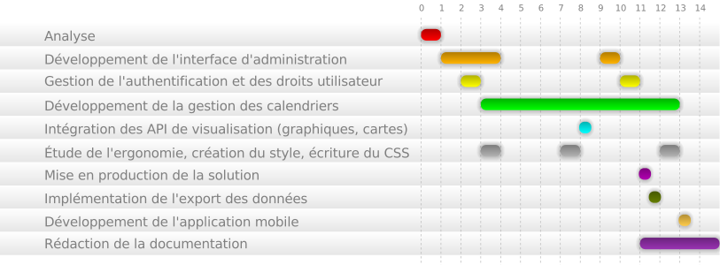

Coûts de la solution
#####################

Pour étudier le coût de notre application, nous avons pris en compte
à la fois l'investissement humain et l'investissement logiciel (coût des
licences etc.)

Investissement Humain :
-----------------------

Coût en jour homme:

======================  ===================================================
Coût (en jours homme)   Taches
======================  ===================================================
4                       Analyse(modélisation, mockups)
4                       Développement de l'interface d'administration
2                       Authentification, gestion des droits utilisateur
1/2                     Affichage des graphiques, géolocalisation
4                       Ergonomie du logiciel
20                      Gestion du calendrier
5                       Phase de tests, correction de bugs
1/2                     Mise en production de la solution
4                       Rédaction de la documentation
1/2                     Application mobile
1/2                     Export iCal
======================  ===================================================

Total: **45 jours-homme**

L'équipe étant constitué de quatre personnes, nous nous sommes réparti le
travail sur un total de 15 jours.

Vous pouvez vous référer au diagramme de GANTT pour plus d'informations

Pour évaluer les coûts, nous évaluons à 100 euros/jour le coût d'un développeur
en entreprise.

Le développement de TIMETABLEEASY à donc eu un coût de "main d'oeuvre", de 40
(jours) * 100 (€) = 4300€.

Investissement Logiciel :
-------------------------

Nous nous sommes appuyé uniquement sur des outils open source pour la *
réalisation de TIMETABLEEASY, ce qui fixe le coût des licences à 0.

Par contre, il est nécessaire de prendre en compte le coût des serveurs utilisés
pour déployer la solution.

Étude de la concurrence et fixation d'un prix pour TIMETABLEEASY:
-----------------------------------------------------------------

Le premier concurrent à notre logiciel est hyperplanning.
Bien implanté dans le monde de l'éducation française ils fixent les tarifs
via un forfait annuel ou en vendant la licence pour l'utilisation du logiciel.

Trois types d'offre sont disponibles :

    - Monoposte avec un seul poste possédant la capacité d'administrer
      le système de planning à 1140 euros HT par an ou 3406 euros HT pour une
      licence "à vie".
    - Réseau local à 2376 euros HT à l'année, 7114 euros HT à vie
    - Réseau local et internet à 3406 euros à l'année et 10204 euros HT à vie.

Pour pouvoir mettre en ligne les plannings, le client devra s'offrir un hébergement
non compris dans l'offre elle même.

Au niveau des fonctionnalités, hyperplanning possède une fonction pour comptabiliser
l'absence et la présence des élèves que nous ne possédons pas.

En revanche nous possédons une capacité à gérer plusieurs universités, la géolocalisation
des différentes universités et autres lieux, la représentation graphique de nos informations
(hors calendrier), et un plus large panel de types d'utilisateurs.

Étant donnée le faible demande, hyperplanning et ses concurrents répondant déjà à une bonne
part du marché, et nous devons nous aligner sur les prix du marché.

À la lumière de ces informations et d'après les coûts induits par le
développement de l'application, nous en fixerons le prix le de licence
d'utilisation à 2000 euros hors-taxes, ce qui nous permettrait de rentabiliser
rapidement notre investissement.

Chaque client sera libre de demander une personnalisation, ou l'ajout de modules complémentaires
à un prix forfaitaire permettant au différents développeurs de maintenir et d'enrichir
l'application.

L'hébergement n'est pas inclus dans le prix du logiciel. Nous proposons des forfaits qui 
permettent d'essayer le logiciel sur des courtes durées, pour ensuite s'engager.

